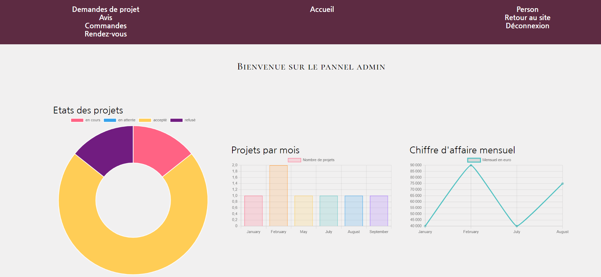
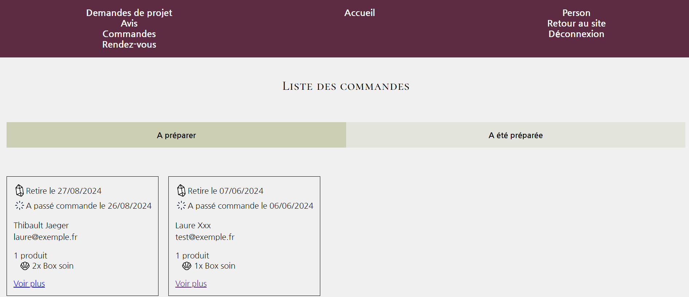
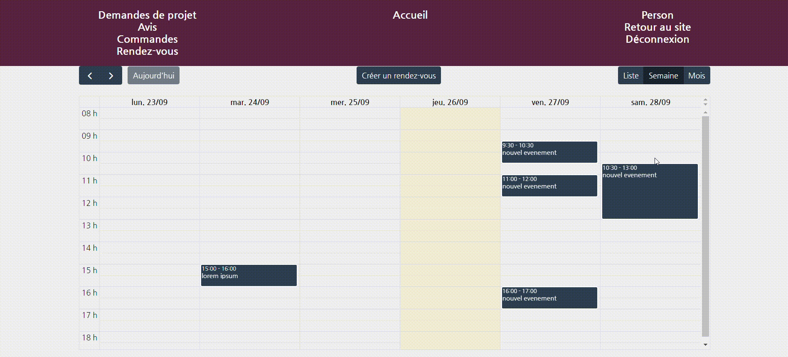

# Ceremonie Couture


Application pour une entreprise qui organise des mariages  

➡️ Site vitrine pour l'entreprise
➡️ Boutique click & collect
➡️ Le client démarre un projet via un formulaire de contact
➡️ Gestion du projet dans le panel admin : ajout de notes, commentaires, prix final, devis
➡️ Suivi visible par l'utilisateur sur sa page profil
➡️ Prise de rendez-vous par un utilisateur ou un admin

## Aperçu


**Panel admin**  




### Mise en place 

**Avoir une version >= PHP 8.2**
[Download PHP](https://windows.php.net/download#php-8.2)

1. **composer** : [composer](https://getcomposer.org/download/) 

2. **scoop** : dans le powershell
 
``` sh
Set-ExecutionPolicy -ExecutionPolicy RemoteSigned -Scope CurrentUser  
```

``` sh
Invoke-RestMethod -Uri https://get.scoop.sh | Invoke-Expression
```

3. **symfony**

``` sh
scoop install symfony-cli
```

Une fois le projet téléchargé, mettre cette ligne dans l'invité de commande pour avoir le bon dossier 'vendor'

``` sh
composer install
```
Démarrer le serveur
``` sh
symfony server:start -d
```

télécharger le fichier .exe **[mailhog](https://github.com/mailhog/MailHog/releases)**    
ouvrir **[localhost email](http://localhost:8025/)**  
